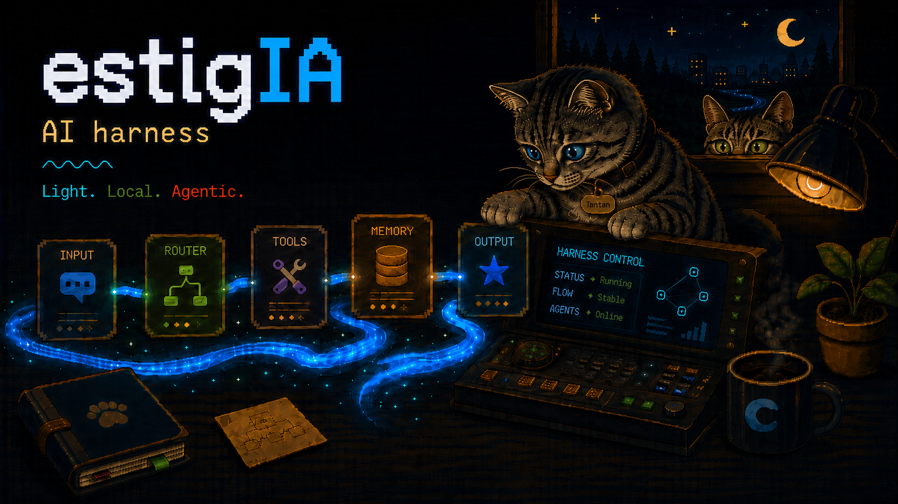

<p align="center">
  
</p>

<p align="center">
  <a href="#install">Install</a> &bull;
  <a href="#a-harness-not-a-document">How it works</a> &bull;
  <a href="#the-tools">Tools</a> &bull;
  <a href="#configuration">Configuration</a> &bull;
  <a href="docs/honesty.md">What it does not measure</a> &bull;
  <a href="openspec/">Specs</a>
</p>

<p align="center">
  <a href="https://github.com/asanabrial/estigia/actions/workflows/ci.yml"></a>
  <a href="LICENSE"></a>
  <a href="https://www.rust-lang.org"></a>
  <a href="#the-tools"></a>
  <a href="#install"></a>
</p>

---

# estig**IA** — workflow authority for AI coding agents

Your agent says it claimed the issue. It says the review passed. It says the branch is current.
Estigia is what turns those sentences from things you trust into things that were checked: the claim
is recorded on the issue tracker's timeline, every write the agent makes afterwards is measured
against it, and a review verdict is bound to exact bytes — so a later push invalidates it, and nobody
has to remember to notice.

One binary. It sits under whatever agent you already use, and it does not run your model.

> *El río del juramento. Lo que un agente promete, queda ligado a unos bytes exactos.*

**Leteo** is the river of forgetting. **Estigia** is the river of the oath — the gods swore by its
waters, and perjury cost nine years outside Olympus. Two rivers of the same underworld, opposite jobs:
one makes you forget, the other holds you to it.

## What it feels like

Mostly, nothing. You do not call Estigia and neither does your agent, beyond claiming the issue it is
about to work on. After that it is simply there, and the only time you hear from it is when it says
no.

A run that has claimed nothing is not under its authority at all and works exactly as it did before —
gating every session would be a lock rather than a workflow. The moment your agent claims issue 12,
every file it writes is measured against that claim, and every step that cannot be undone — a push, a
merge, a tag, a release — re-reads the tracker before it happens.

When it does refuse, it says what it read and what to do about it:

```
$ git push origin HEAD
estigia: git push: gh issue view failed (1): none of the git remotes ... (read-failed)
  [world-action] the tracker could not be read; write nothing and retry the read
error: failed to push some refs
```

*The tracker could not be read* is a different answer from *you may not push*, and Estigia will not
turn the first into the second. That distinction is most of the design.

## What it is not

It is not memory ([Leteo](https://github.com/asanabrial/leteo) does that), and it is not planning.
It does not run your model, define your tools, or manage your context — it sits under whatever
agent you already use and holds one thing: the workflow authority. A feature that does not fit that
sentence does not go in.

## Install

```sh
# Linux and macOS
curl -fsSL https://raw.githubusercontent.com/asanabrial/estigia/main/scripts/install.sh | sh
```

```powershell
# Windows
irm https://raw.githubusercontent.com/asanabrial/estigia/main/scripts/install.ps1 | iex
```

That is all of it. Nothing to install first — not Rust, not Python, not a runtime. The archives are
prebuilt binaries, and each script checks its download against the checksum published beside it and
refuses to install anything that does not match. The binary lands in `~/.local/bin`, or on your PATH
on Windows; `ESTIGIA_INSTALL_DIR` moves that and `ESTIGIA_VERSION` takes a tag other than the latest.

To build it yourself instead, which is the one route that needs Rust:

```sh
cargo install --git https://github.com/asanabrial/estigia
```

A source build is treated as a source build from then on: it has no installer record, so the commands
that write into your agents ask for `--allow-source-build` before they will. That is deliberate — see
[`docs/lifecycle.md`](docs/lifecycle.md) for what the record proves, which is narrower than it sounds.

If you develop Estigia itself on Windows, `scriptsuild-install.ps1` does the whole loop from a
checkout: installs Rust if needed, compiles the locked release build, reinstalls through Cargo, runs
setup for every agent, and finishes with `status` and `doctor`. Close the agents using Estigia first —
Windows will not replace a binary that is running.

## Set it up in your agents

Installing the binary changes nothing on its own. This is the step that puts Estigia in front of an
agent:

```sh
estigia setup                  # the setup screen: agents on the left, that agent's settings on the right
estigia setup claude-code      # or just one, without the screen
estigia setup --all            # or all of them
```

Look before you leap, at any time:

```sh
estigia setup claude-code --dry-run   # exactly what would change, writes nothing
estigia status                        # what is installed, where, and what runs still hold
estigia doctor                        # skill, transport, gh, remote, guard — read-only
```

`setup` installs three core things: the skill an agent reads, a short directive in that agent's
always-loaded instruction file, and the lifecycle hooks that make the authority mechanical rather than
advisory. `--skill-only` stops before the directive. Estigia knows eleven agents; the hooks go into
every one with an event able to refuse — ten of them, in five dialects. Every Claude Code setup also
installs one static read-only `review-blind.md` definition with `model: inherit`, including when `Blind
judges` is `single`. It is inert unless a launch supplies an active blind mode, exact publication
receipt and criteria. The orchestrator passes the effective `judge` model and launches that same
definition twice or five times; setup never creates numbered judge files. Direct `config set` and
`config edit` writes do not mutate external definitions.

The setup screen is the one path here that needs a person, and it ends by printing the commands that
reproduce the same result without it:

```
the same result without the questions:
  estigia setup claude-code
  estigia config set "Blind judges" "two blind" --agent claude-code
```

`five blind` is the other panel choice. It requires five concurrent independent contexts over one
immutable target and criteria, with 3-of-5 independently confirming the same severe finding before it
blocks acceptance or authorizes automatic repair. The transport still records one aggregate exact-
receipt verdict; it does not prove the panel ran.

Whoever does this again — on another machine, in a script, in a container image — needs the spelling
that does not ask questions, and the run that just worked is the only honest place to learn it. Those
commands produce a byte-identical result to the one the questions produced, and a test runs both to
check that they do.

`status` reports two things separately, because *the agent was told about Estigia* and *Estigia can
stop it* are different answers, and somebody looking at a run that wrote without a claim needs the
second one:

```
claude-code    configured
               harness: gate on, tools on
codex          configured
               harness: gate off, tools on
```

## Uninstall

```sh
estigia uninstall --all --dry-run   # what would go, changes nothing
estigia uninstall --all             # carry it out
```

The first tells you what the second will do. To leave one agent and stay in the rest:

```sh
estigia uninstall claude-code
```

And the push guard, which lives in a repository rather than in an agent:

```sh
estigia guard --uninstall
```

**Uninstall removes what Estigia created, and nothing else.** Not another tool's block, not your own
notes, not a file that was already there when Estigia wrote over it — and not a file of Estigia's own
that you have since edited, which it keeps and names on its own line rather than taking silently. It
knows the difference because install wrote down what it created and a digest of what it put there;
nothing on disk could tell them apart afterwards.

Two things it deliberately leaves. `~/.estigia/` is yours rather than any agent's — the screen's
language, your list of checkouts — and taking one agent out of eleven must not take it. A checkout's
own rows in `.git/estigia/` stay too: uninstall was given an agent, not a repository, and reaching
into whichever checkout you happened to be standing in is the failure that design refuses.
`estigia config forget` is the one command that removes those, and it says which file it removed.

The whole account, including what `REPLACE` and `OVERWRITE` mean and why they are two words, is in
[`docs/what-it-writes.md`](docs/what-it-writes.md).

## Swear to an issue

```sh
estigia claim 12 --run-id claude-0198fe1c --horizon 2026-08-01T18:00Z
estigia gate Edit --run-id claude-0198fe1c --input '{"file_path":"src/x.rs"}'
estigia release --run-id claude-0198fe1c
```

An agent does this through the MCP tools instead — you will not type these often. The run id is
minted from the agent's session and reported by `SessionStart`, so the agent already has it. It is
asked for rather than guessed, because a claim recorded under the wrong run id is a claim the gate
will never match, and being asked beats being silently wrong.


## A harness, not a document

Estigia is a **harness**: it does not ask an agent to follow the workflow, it holds the tools.

The contract under `skill/` is text an agent may read and may ignore — which meant "perjury detected
mechanically" was aspirational. Nothing stopped a run from writing without a claim, or from
delivering on a verdict bound to a SHA that no longer existed. The harness closes the first of
those, and binds the second without re-checking it at the moment of delivery — see [`docs/honesty.md`](docs/honesty.md) for exactly
where that line falls:

```
agent (Claude Code)
  │
  ├─ tool: Edit / Write / Bash
  │    └─ PreToolUse → estigia hook pre-tool-use
  │         └─ verify_claim against the tracker → deny
  │
  └─ tool: mcp__estigia__claim / verify_claim / transition / …
       └─ estigia mcp → answered in this process, against `gh`

git
  └─ pre-push → estigia hook pre-push
       └─ refuses a push no live claim authorises, whoever typed it
```

Two halves, and both are needed. The **tools** are how an agent does workflow work at all — twenty-one
operations with schemas, instead of composing `gh` by hand and hoping. The one force-push the
delivery path needs is among them, so it is adjudicated like every other write rather than typed into
a shell. The **gate** is what happens
when it tries to work around them.

Estigia does not run the model and holds no authority of its own. **The tracker's timeline is the
only source of truth** — no local database of claims, so two runs on two machines still adjudicate
against each other and a run that dies leaves no phantom state behind.

### The gate no agent can route around

An agent hook fires only for the agent that installed it. A `pre-push` hook sits **under git**:

```sh
estigia guard              # into this repository
estigia guard --uninstall  # removes only a hook Estigia wrote
```

```
$ git push origin HEAD
estigia: git push: gh issue view failed (1): none of the git remotes ... (read-failed)
  [world-action] the tracker could not be read; write nothing and retry the read
error: failed to push some refs
```

It catches the *last* moment rather than the first, and it catches it for every agent, and for a
person. The `PreToolUse` gate is still the one that matters most — it catches a lost claim race
hours before a push — but only one agent has it.

### The oath binds once sworn

A run that has claimed nothing is not under Estigia's authority, and every write it makes goes
through untouched. Gating every session would be a lock, not workflow authority.

The moment a run swears — `estigia claim 12` — every repository write it makes is measured against
that claim, and every irreversible boundary re-reads the timeline. That is where the value is.
Incident I07 in the skill's own ledger is not "an agent wrote without claiming"; it is a run that
**lost a claim race by five seconds, was told 33 seconds later, and worked another 48 minutes**
because nothing in its loop read the timeline again. That run had sworn. The gate kills that case.

```
$ estigia gate Edit --run-id claude-0198fe1c --input '{"file_path":"src/x.rs"}'
estigia: src/x.rs: gh issue view failed (1): no git remotes found (read-failed)
  [world-action] the tracker could not be read; write nothing and retry the read
```

A routine write may ride on an answer from inside a two-minute renewal window — the cadence
`SKILL.md` already asks for. **An irreversible boundary never does**: `git push`, `git merge`,
`git tag`, `gh pr merge` and `gh release create` always re-read.

The gate only ever *reads* the tracker, which is what lets it sit on the critical path of every edit:
being wrong costs a refused write, never a damaged issue. A test enforces that structurally.


## The tools

Twenty-one operations, table-driven, each mapping to one the contract requires the binding to provide.
`tools/list` carries a schema and a `readOnlyHint`, so an agent can tell a read from a write without
reading this source:

```
read   verify_claim     (issue, run_id, expect_state)
read   list_state       (state, run_id)
read   expected_target  (base)
read   base_movement    (base, recorded_base)
read   check_closing_keywords (issue)
WRITE  changelog_notes  (version, file)
WRITE  audit_board      ()
WRITE  claim            (issue, run_id, horizon)
WRITE  heartbeat        (issue, run_id, expect_state, body_file)
WRITE  transition       (issue, to, run_id)
WRITE  comment          (issue, body_file)
WRITE  reclaim          (issue, run_id, horizon)
WRITE  release          (issue, run_id)
WRITE  ensure_states    ()
WRITE  start_branch     (issue, run_id, branch, base)
WRITE  create           (identity, title, body_file, priority, domain, runtime, run_id)
WRITE  publish_review   (issue, run_id, branch, base, pr_title, pr_body_file)
WRITE  republish_review (issue, run_id, branch, base, pr_title, pr_body_file)   # leased force-push
WRITE  handoff_review   (issue, run_id, target_operation, epoch, pr, head, base, digest, blocker, discharger)
WRITE  record_review_verdict (issue, run_id, reviewer, epoch, pr, head, base, digest, outcome)
WRITE  release_ci       (issue, run_id, epoch, pr, head, base, digest)
```

Twenty-one tools. The contract names nineteen operations every binding must map; four are not exposed and each says
why in `NOT_EXPOSED` — `publish_version` and `close` are declared *(agent, not scripted)* upstream,
`last_activity` maps to a raw `gh` call rather than the transport, and `label` is not mapped by the
GitHub binding at all. A seam test holds the two lists together: an operation that is neither
exposed nor declared fails the build.

The MCP server is hand-written rather than built on `rmcp`. The same binary answers a `PreToolUse`
hook on **every edit**, so a `tokio` runtime spun up per process is a cost paid thousands of times to
move a few lines of JSON across a pipe. Keeping the crate synchronous is what keeps the gate cheap.
What that costs is in `UNIMPLEMENTED`: no resources, no prompts, no sampling, no notifications beyond
`initialized`, and one request at a time.

## Configuration

Eighteen typed settings, in [`docs/configuration.md`](docs/configuration.md). Reading the table produces a
valid configuration or a refusal naming what may be written instead.

## The ratchet

> A message may name a command only when running it discharges the block.
> Naming a dead end is worse than naming nothing.

Every refusal carries a typed code, what happened to the world, whether a replay is safe, and a
resolution. The resolution is either a runnable invocation — checked against the real parser by
`every_command_a_rejection_names_parses` — or a reason from a closed vocabulary saying why no
command can honestly exist: `operator-knowledge`, `world-action`, `human-authority`.

```
$ estigia setup
estigia: setup needs to know which agent to configure (agent-not-named)
  run: estigia setup --all   # or one of: agents, claude-code, codex, opencode, gemini-cli, cursor, qwen
```

Measured against issue-flow on 2026-07-31: **87** rejection sites, **zero** naming an executable
continuation. Starting at zero is the only moment a ratchet can start.

## What this instrument does not measure

It has its own document: [`docs/honesty.md`](docs/honesty.md). Roughly thirty entries naming what this crate
does **not** check — the gaps it knows about, each with the measurement that found it. A claim added
anywhere else in this repository is weighed against that file first.

## Layout

```
src/harness/   the gate, the run pointer, the transport, the lifecycle protocol, doctor
src/harness/mcp/  the workflow tools and the stdio JSON-RPC they arrive on
src/setup/plugin.rs  the OpenCode gate, because OpenCode reads a module rather than a settings line
build.rs       derives the transport's refusal vocabulary from the transport itself
src/fence.rs   a marked block in somebody else's file — invariant three, written once
src/config/    typed model, the settings table as data, which markers the table lives in
src/setup/     agent adapters, companions, dry-run, exact inverse
src/skill.rs   the embedded markdown and its install/status/uninstall
src/outcome.rs the failure taxonomy: what landed, what may be replayed, what to run
src/cli/       dispatch, and the only place a refusal becomes an exit code
skill/         SKILL.md, bindings/, policies/, protocols/, references/, assets/, agents/ — not compiled
docs/          the reference the sections above point at, one question each
openspec/      what a change is for, agreed before it is written
scripts/       the two installers a release is fetched with, and the Windows source reinstall
assets/        branding, referenced from this file
```

Two documents sit beside the code rather than inside it, and they answer different questions from
this one. [`AGENTS.md`](AGENTS.md) — which `CLAUDE.md` is a link to — is how an agent works here and
what it owes the documentation. [`openspec/`](openspec/README.md) is where a change's shape is
agreed, in the layout [`skill/protocols/sdd.md`](skill/protocols/sdd.md) defines for everybody else;
using our own convention on ourselves is the cheapest way to find out when it is wrong.

`src/transport/` is the transport, and it is the only one. It began as `skill/scripts/github.py`,
shipped inside the payload because `bindings/github.md` routed every reversible operation through
it — a payload without it was a binding whose first command did not exist. The binding now names
Estigia's own tools, the operations are answered in this process, and the script is deleted: no
`.py` file in the tree, no Python on any path, nothing in CI that installs one. What the
crossings against it are worth now is in the honesty contract above, under its own heading.

*No interpreter at all* is what this sentence used to say, and it stopped being true when one test
began **executing** the OpenCode plugin this crate generates rather than reading its source. That
plugin is JavaScript; a gate written in a second language and never run is a copy of a rule nothing
crosses. So `node` is on the verification list in [`AGENTS.md`](AGENTS.md), both workflows install it
rather than trusting the runner image to, and `docs/honesty.md` records what that test measures.

One crate. Five on day one would split boundaries before any of them had earned the split; a
boundary gets split out when it has earned the seat.

## Exit codes

Four, and none of them means "something went wrong":

| Code | Meaning |
|---|---|
| `0` | the command did what it said |
| `1` | the command refused, and **nothing was written** |
| `2` | the world may have changed and this process cannot tell |
| `3` | the invocation could not be read: nothing was attempted, and **nothing was decided** |

The fourth is apart from `1` because the difference is the whole reason the hooks read a status at
all. A refusal is a decision — the world said no — and every script this crate writes propagates it,
which is what blocks a push. A usage error is not a decision, and propagating it blocks a push for a
reason the person typing it cannot act on. It was measured: a `pre-push` hook left from a build whose
`hook` took one more flag exited `1`, and `git push` came back `error: unexpected argument
--from-a-newer-build` with the push refused.

This section said **three** for as long as the fourth existed, which is the drift the first rule of
`CLAUDE.md` forbids — and the readers it describes are scripts. `every_exit_code_the_readme_lists_is_one_this_binary_has`
crosses the table against the enum now.

The harness translates the transport's own five codes into that taxonomy rather than collapsing
them. `1` the control surface was read and answered stop — do not replay. `2` the operator's
configuration is wrong — the one with a command that fixes it. `3` the control surface answered
**nothing** — retry the read, and never treat it as a stand-down or as clearance. `4` and `5` a
write may have landed and nobody saw — go and look.

The distinctions live in the refusal, where they can be read. issue-flow's `5` meant both "nothing
was written" and "something was written and I do not know what"; reporting the nearest named state
is a lie told with confidence.

## Licence

MIT.
